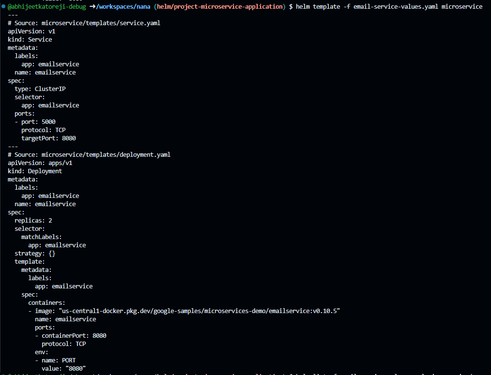
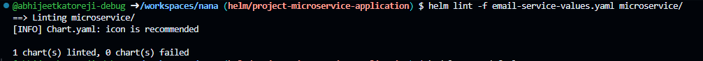
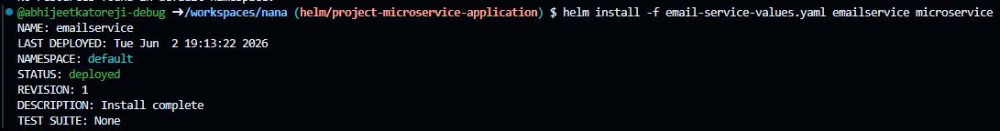
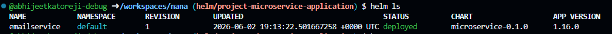
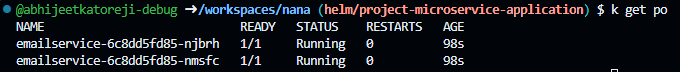
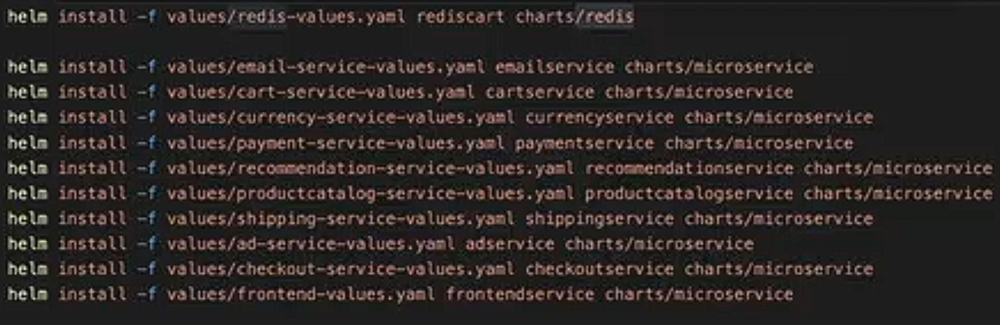
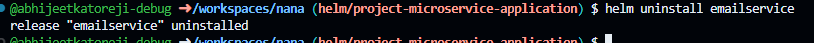
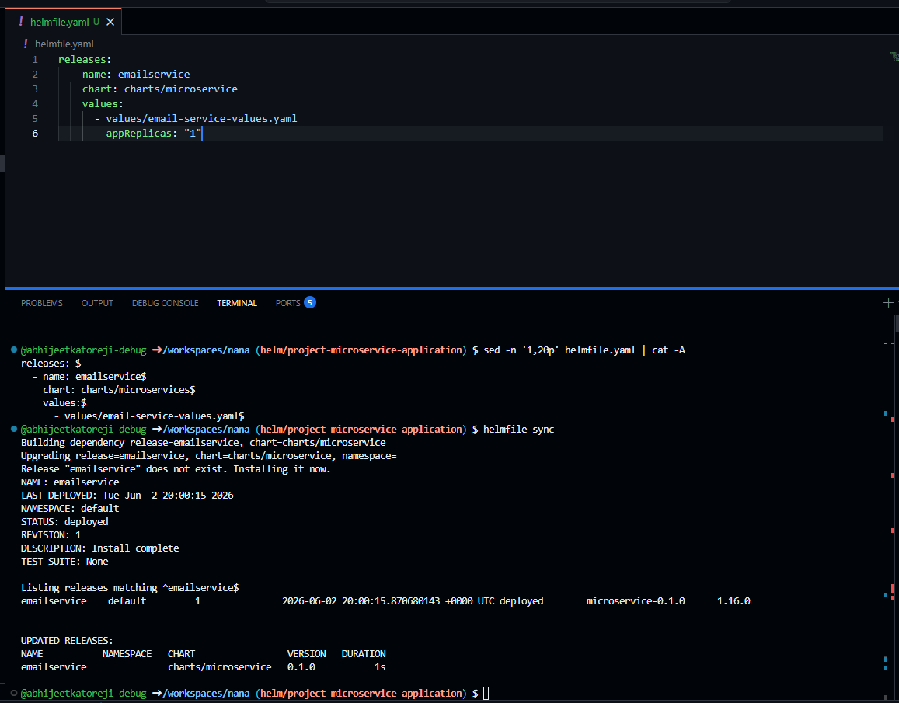
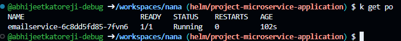
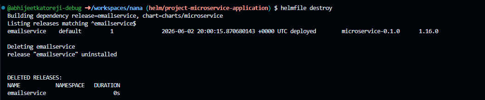

# What I did

- **Date:** 2026-06-02
- **OS:** Linux
- **Repository:** nana (owner: abhijeetkatoreji-debug)
- **Branch:** helm/project-microservice-application

## Actions performed

- Ran `helm ls` to list Helm releases (command exited with code 0).
- Confirmed Helm CLI is available on the system.

## Commands run

- `helm template -f email-service-values.yaml microservice`
   
   also
   `helm template -f values/email-service-values.yaml charts/microservice`
- `helm lint -f email-service-values.yaml microservice`
   

- `helm install --dry-run -f values/email-service-values.yaml release_name charts/microservice`
    gives preview of what all things will be installed in the cluster
- `helm install --dry-run -f values/email-service-values.yaml emailservice charts/microservice`
- `helm install -f email-service-values.yaml emailservice microservice`
   
- `helm ls` (command exited with code 0)
   
- `k get po` (command exited with code 0)
   

## Notes

- If you want, I can capture the exact `helm ls` output, or add more commands you ran.
- Next suggested step: run `helm repo update` and then `helm install` for deployments.

examples:

- `helmfile sync`

- `helmfile destroy`
